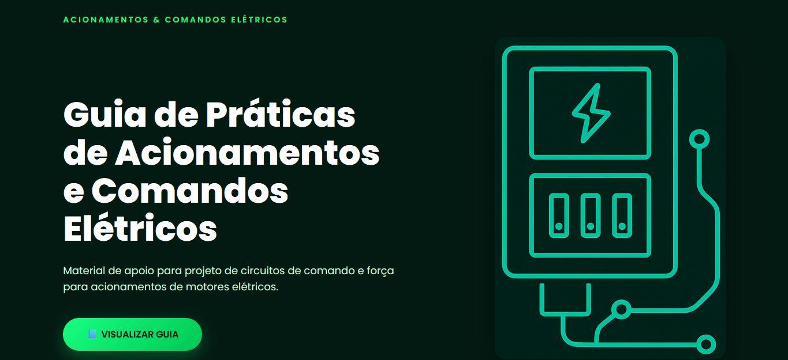
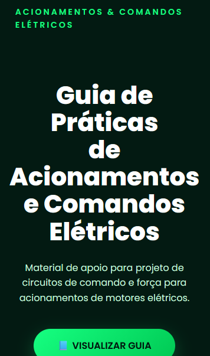

# Guia Prático – Acionamentos e Comandos Elétricos

Este projeto foi desenvolvido como parte de um **Projeto Integrador**, com o objetivo de disponibilizar um **guia prático para estudo e consulta sobre acionamentos e comandos elétricos**.

O site foi criado para facilitar o acesso ao material didático produzido pela equipe.

## 🖥️ Preview do Site

## 🖥️ Preview do Site Mobile

  

---

## 📚 Sobre o Projeto

O projeto apresenta um guia de apoio para estudantes e profissionais que desejam compreender melhor os **princípios de acionamento de motores elétricos e circuitos de comando**.

A página web funciona como um portal simples para visualização do material desenvolvido.

---

## 🌐 Demonstração

Acesse o site publicado:

🔗 https://rubenn34.github.io/Acionamentos-ComandosEletricos/

---

## 🚀 Tecnologias Utilizadas

- HTML5
- CSS3
- GitHub Pages

---

## 📄 Conteúdo do Guia

O material aborda temas importantes da área de comandos elétricos, como:

- Conceitos de acionamentos elétricos
- Circuitos de comando e potência
- Dispositivos de proteção
- Contatores e relés
- Diagramas elétricos
- Aplicações práticas
- Segurança em instalações elétricas
- Análise de circuitos de comando

---

## 💻 Como Executar o Projeto

1. Clone o repositório

2. Abra o arquivo **index.html** no navegador.

---

## 👨‍💻 Autor

Desenvolvido por **Ruben Miquéias Costa**

GitHub:  
https://github.com/Rubenn34
